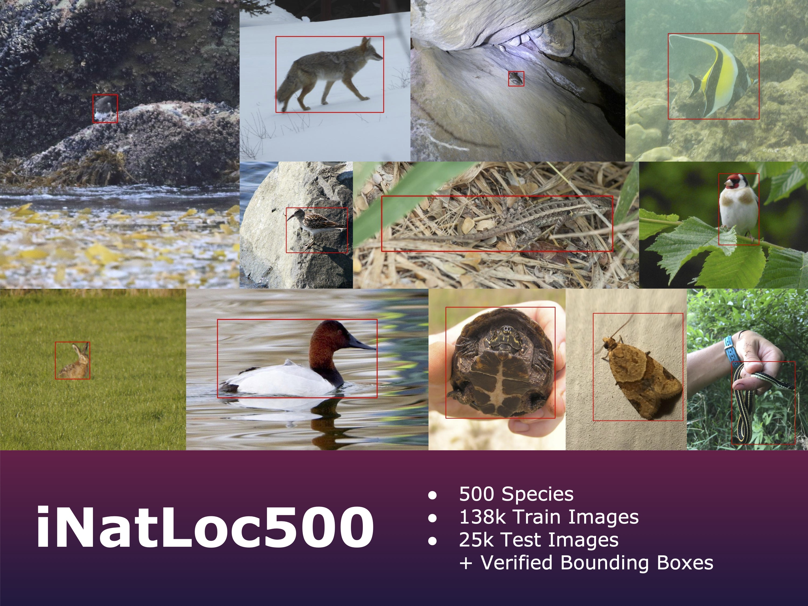
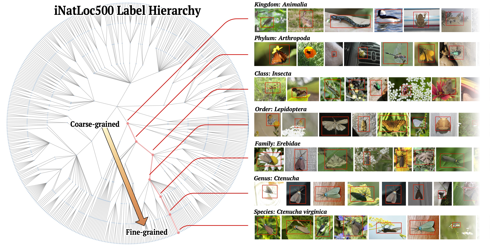

# The iNatLoc500 Dataset
The iNaturalist Localization 500 (iNatLoc500) dataset is a large-scale fine-grained dataset for weakly supervised object localization (WSOL). This dataset was released as part of the paper [On Label Granularity and Object Localization](https://arxiv.org/abs/2207.10225) (ECCV 2022).

## Splits

Split | # Species | # Images | Avg. # Images per Species | Image-Level Labels? | Bounding Boxes? | Purpose
--- | --- | --- | --- | --- | --- | ---
`train` | 500 | 138k | 276 | Yes | No | Classifier training
`val` | 500 | 12.5k | 25 | Yes | Yes | Localization evaluation
`test` | 500 | 12.5k | 25 | Yes | Yes | Localization evaluation

Each image in the `val` and `test` splits has been checked to ensure that exactly one instance of the species of interest is present and that the bounding box is accurate. Full details on the dataset construction process can be found in [the paper](https://arxiv.org/abs/2207.10225). 

## Label Hierarchy

iNatLoc500 is equipped with a label hierarchy based on the biological tree of life. The levels of the label hierarchy are (from finest to coarsest): `species`, `genus`, `family`, `order`, `class`, `phylum`, `kingdom`. Since all of the species in iNatLoc500 are animals, the `kingdom` level has only one node (`Animalia`). The iNatLoc500 dataset can be labeled at any level of the label hierarchy. For convenience we provide metadata files for each level of the label hierarchy, as described [here](dataset/README.md).



# Download Instructions
Instructions for downloading the dataset can be found [here](dataset/README.md). 

# Extras
* [`mappings`](mappings/): Files that link iNatLoc500 images to their sources in iNat17 and iNat21. 

# Reference
If you find our work useful in your research please consider citing our paper:  

```latex
@inproceedings{cole2022label,
  title={On Label Granularity and Object Localization},
  author={Cole, Elijah and 
          Wilber, Kimberly and 
          Van Horn, Grant and 
          Yang, Xuan and 
          Fornoni, Marco and 
          Perona, Pietro and 
          Belongie, Serge and 
          Howard, Andrew and 
          Mac Aodha, Oisin},
  booktitle={European Conference on Computer Vision},
  year={2022},
  organization={Springer}.
}
```
